# 🏛️ NEU Library Log: Smart Visitor Management

The **NEU Library Log** is a professional digital check-in ecosystem designed to replace inefficient paper logbooks. By leveraging institutional emails and dynamic QR code technology, it provides a seamless entry experience for students and faculty while equipping administrators with powerful data analytics and security controls.

---

## 🌐 Live Demonstration

<div align="center">
  <br>
  <a href="https://neu-library-log.onrender.com">
    
  </a>
  <br>
  <p align="center">
    <i>To try out the admin dashboard use (admin@neu.edu.ph).</i>
  </p>
</div>

> [!IMPORTANT]
> **Database Availability:** This trial deployment is active until **April 14, 2026**, because i'm using a free trial database service.  
> **Loading Note:** As this is hosted on a free tier, the server may need 1-3 mins to "wake up" upon your first visit.

> [!CAUTION]
> ***Usage Guidelines:***
> * **No Spamming:** Please refrain from creating multiple "test" entries to avoid hitting the free-tier database storage limits. 
> * **Data Integrity:** Do not delete or modify existing logs or user records (you can delete your own entries for testing).
> * **Monitoring:** All entries are logged for demonstration purposes. Abuse of the system may result in the live link being taken down.

---

## ✨ How It Works: A System Walkthrough.

### 🤳 Fast Check-In
This is the "front door" of the system where users scan their codes or register.

- **Instant Logging:** Check in under 5 seconds by simply entering your institutional email or scanning your personal QR code.
<div align="center">
  <a href="./screenshots/login.png">
    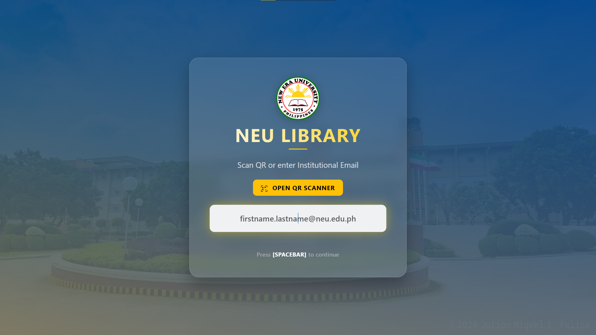
  </a>
</div>

- **Digital Registration:** If you are a new user, the system will automatically detect your email and guide you to the registration page.
<div align="center">
  <a href="./screenshots/registration.png">
    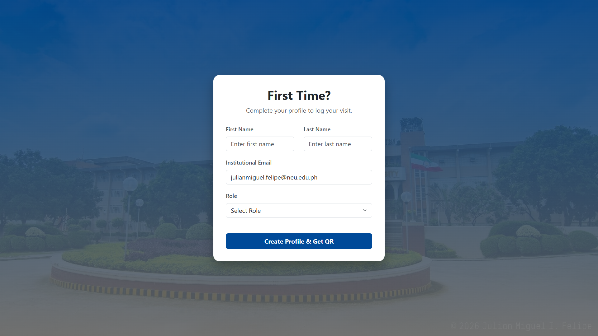
  </a>
</div>

- **Visit Purpose:** After logging in, users can quickly select their reason for visiting, such as "Research," "Study," or "Borrowing."
<div align="center">
  <a href="./screenshots/purpose.png">
    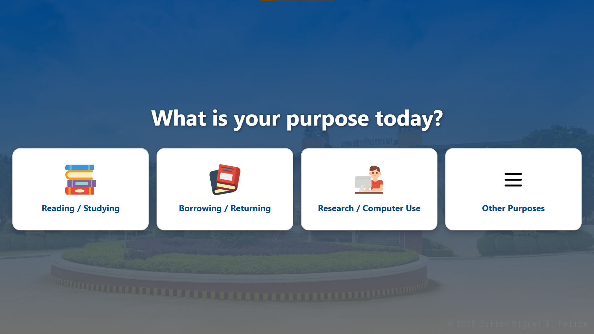
  </a>
</div>

- **Welcome Message:** Every visitor receives a personalized greeting to confirm their visit has been recorded.
<div align="center">
  <a href="./screenshots/welcome.png">
    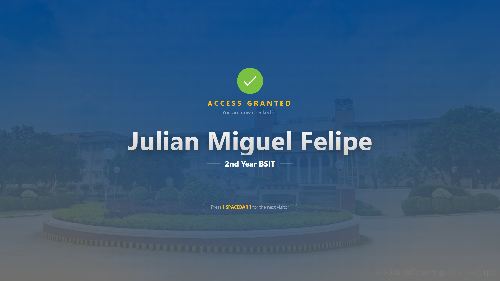
  </a>
</div>

---

### 📧 Personal QR Codes
No more physical ID cards or messy paper slips.

- **Auto-Email:** Upon successful registration, the system automatically sends a unique, permanent QR code to the user's email.
<div align="center">
  <a href="./screenshots/email_qr.png">
    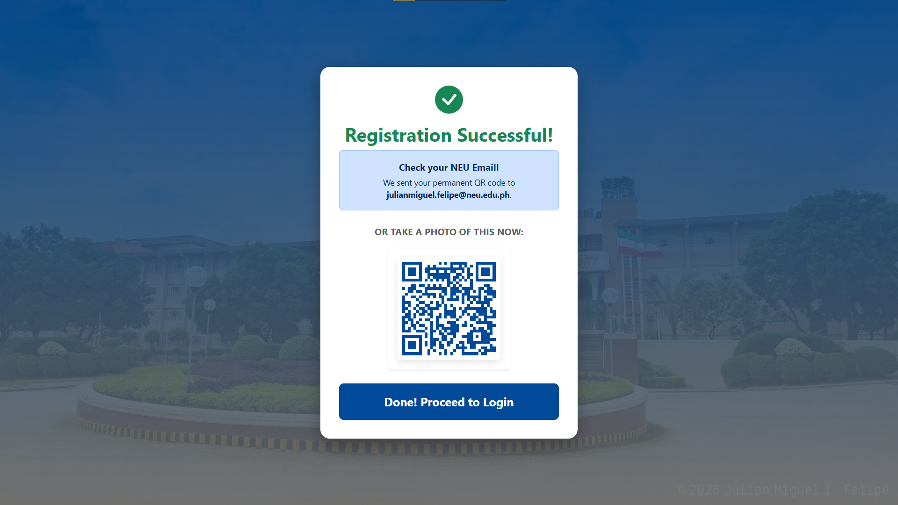
  </a>
</div>

- **Always Available:** Users can simply save the QR code image to their phones for a contactless "scan-and-go" experience on all future visits.
<div align="center">
  <a href="./screenshots/phone_qr.png">
    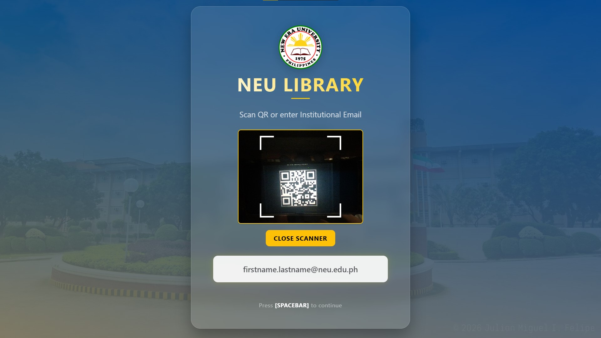
  </a>
</div>

---

### 📊 Admin Insights Dashboard
A powerful tool for library staff to manage the space and view usage data.

- **Admin Detection:** If an authorized admin email is entered, the system offers a choice between opening the dashboard or logging a normal visit.
<div align="center">
  <a href="./screenshots/admin_detect.png">
    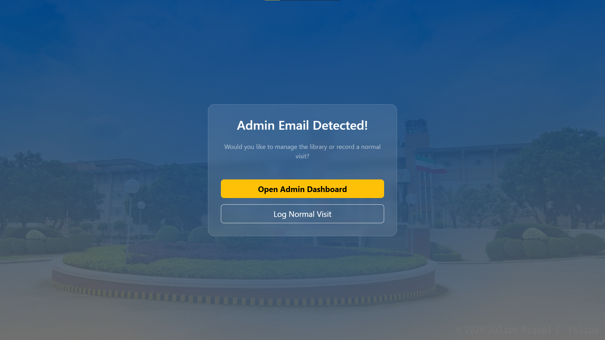
  </a>
</div>

- **Secure Login:** To protect sensitive data, the dashboard requires a username and password in case an admin email is ever compromised.
<div align="center">
  <a href="./screenshots/admin_login.png">
    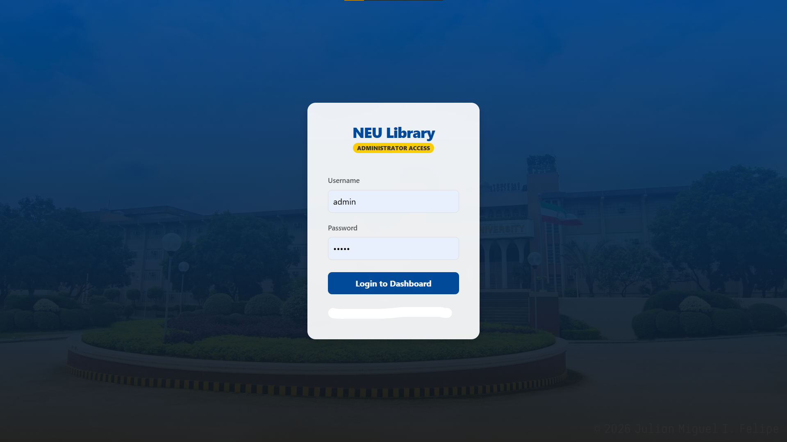
  </a>
</div>

- **Metric Cards:** Real-time counters track library visitors for the day, week, and month in easy-to-read numeric cards.
<div align="center">
  <a href="./screenshots/metrics.png">
    
  </a>
</div>

- **Analytics Charts:** The dashboard provides interactive bar and pie charts to visualize visitor data by department and position (Faculty vs. Student).
<div align="center">
  <a href="./screenshots/charts.png">
    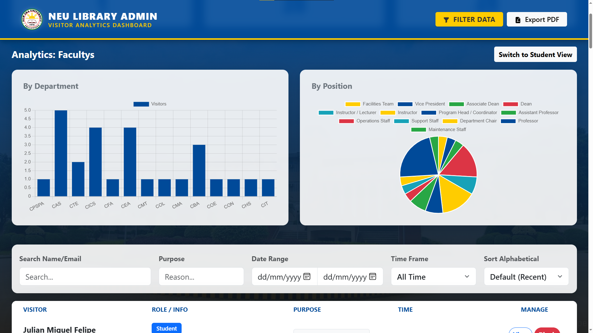
  </a>
</div>

- **History Table:** View detailed visitor records, including visit purposes, timestamps, and specific student details.
<div align="center">
  <a href="./screenshots/history.png">
    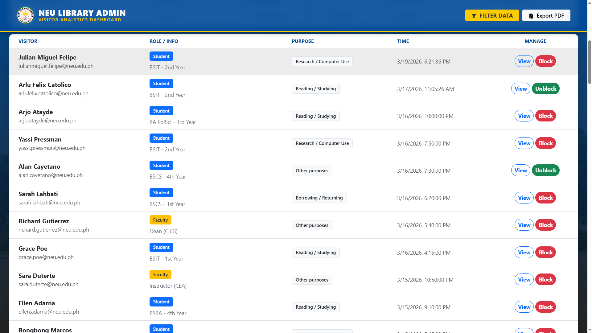
  </a>
</div>

- **Search & Sort Toolbar:** Admins can quickly locate records by searching names/emails or filtering by date ranges and visit purposes.
<div align="center">
  <a href="./screenshots/toolbar.png">
    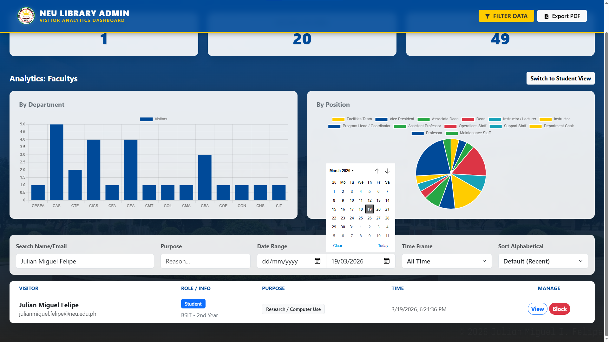
  </a>
</div>

- **Management Controls:** Maintain security by using built-in controls to "Block" specific users or "Delete" outdated records.
<div align="center">
  <a href="./screenshots/controls.png">
    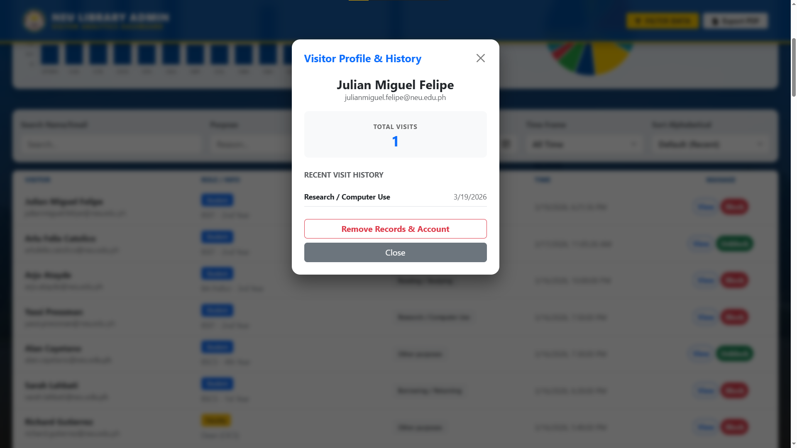
  </a>
</div>

- **Filtered PDF Exports:** Need a physical report? Admins can filter the records for example, showing only "Faculty" entries or a specific date—and instantly export that data into a clean, downloadable PDF document.
<div align="center">
  <a href="./screenshots/pdf_filter.png">
    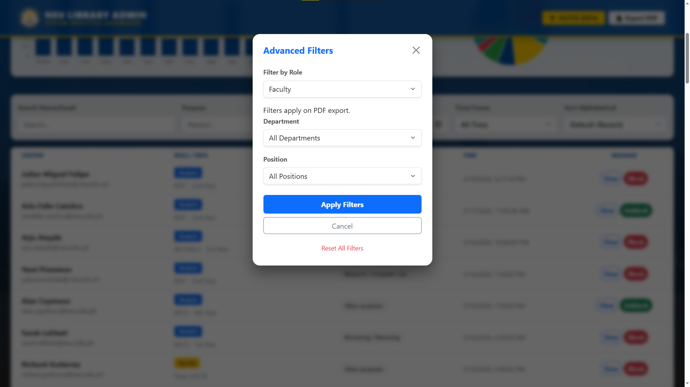
  </a>
</div>
<div align="center">
  <a href="./screenshots/pdf_export.png">
    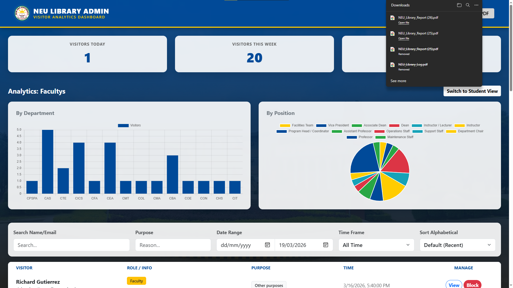
  </a>
    <a href="./screenshots/pdf_export.png">
    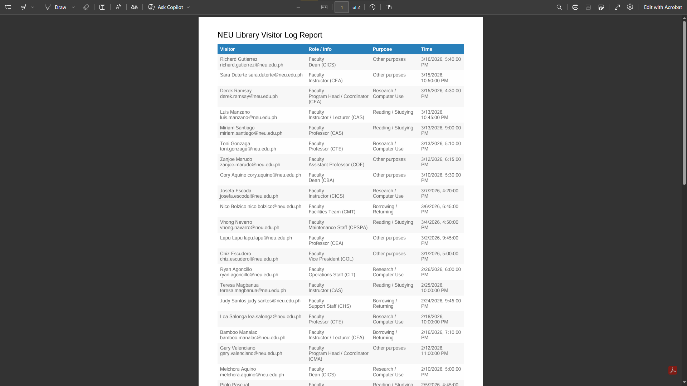
  </a>
</div>

---

## 📂 System Architecture

| Component | Responsibility |
| :--- | :--- |
| **`/public`** | **Frontend Layer:** The "Face" of the app (HTML5, CSS3, Vanilla JS). |
| `index.html` | The primary Kiosk interface for user check-in. |
| `admin.html` | The secure analytics portal for library staff. |
| `admin-login.html` | The security login page for the admin dashboard. |
| `register.html` | The registration page if detected a new user. |
| `admin.html` | The secure analytics portal for library staff. |
| **`/src`** | **Logic Layer:** The "Brain" of the application. |
| `server.js` | Express.js engine handling API routing and server-side logic. |
| `db.js` | PostgreSQL bridge managing the connection pool and initialization. |
| **`.env`** | **Security Layer:** Encrypted storage for database credentials and API keys. |

---

## 🧰 Technology Stack

| Layer | Technology |
| :--- | :--- |
| **Frontend** | HTML5, CSS3, Bootstrap 5, JavaScript (ES6+) |
| **Backend** | Node.js, Express.js |
| **Database** | PostgreSQL |
| **Email Service** | EmailJS API |
| **Hosting** | Render (Web Service & Managed PostgreSQL) |
| **Version Control** | Git & GitHub |

---

## 🚀 Local Development

### 🔧 Prerequisites
* **Node.js** (LTS version recommended)
* **PostgreSQL** instance (local or remote)

### 📦 Installation & Setup

1. **Clone the repository**
   ```bash
   git clone [https://github.com/JulianMiguelFelipe/neu-library-log.git](https://github.com/JulianMiguelFelipe/neu-library-log.git)
   cd neu-library-log
2. **Install dependencies**
   ```bash
   npm install

3. **Configure Environment Variables**
   ```bash
   DATABASE_URL=your_postgresql_connection_string
   SESSION_SECRET=your_random_secret_key

4. **Launch the application**
   ```bash
   npm src/server.js start

**The server will run on http://localhost:3000.**
